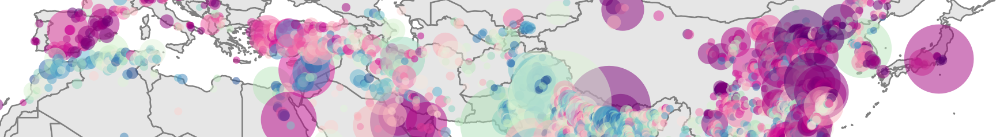
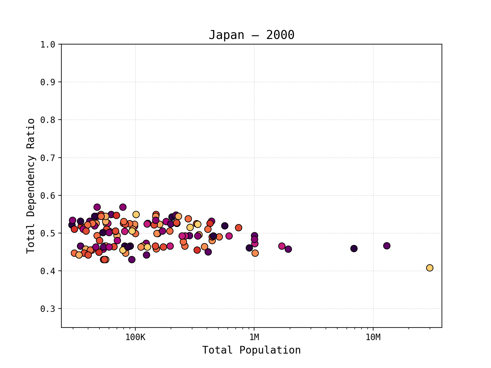
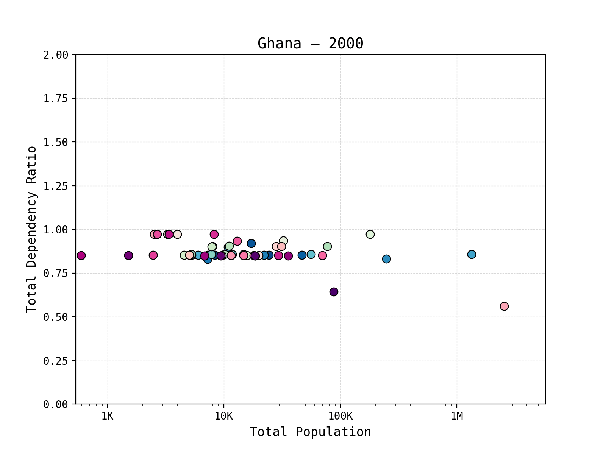
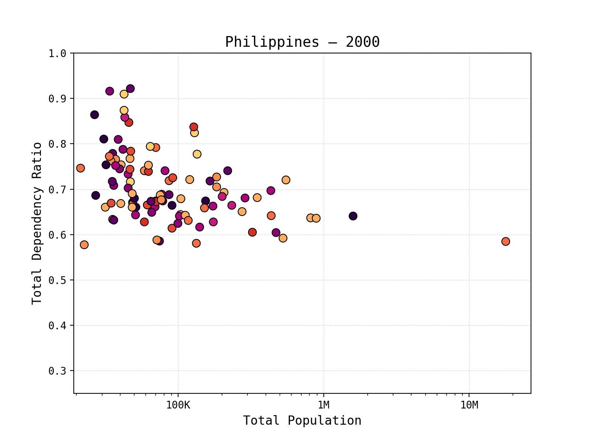

# Global Urban Demographic Change and Migration Patterns 🌍 🌆 👪
  

---
## Overview

This repository accompanies the manuscript and provides access to the code and data for globally consistent, city-level estimates of urban demographic structure, natural change, and migration for > 10,000 cities from 2000–2020 using both static and dynamically evolving urban boundaries.

### Change in Urban Dependency Ratio Between 2000-2020

<table>
  <tr>
    <td align="center">
      <br>
      <b>Japan</b>
    </td>
    <td align="center">
      <br>
      <b>Ghana</b>
    </td>
  </tr>
  <tr>
    <td align="center">
      <br>
      <b>United States</b>
    </td>
    <td align="center">
      <br>
      <b>Philippines</b>
    </td>
  </tr>
</table>  

View this [interactive population animation](https://zimmermaps.github.io/urban_demography/interactive_population_animation.html) to explore plots for all countries!

## What This Repository Provides

This repository contains:

- Final demographic datasets for >10,000 cities (2000–2020)
- Both static and dynamic urban boundary definitions
- Derived demographic indicators including dependency ratios, fertility, mortality, and migration
- Code used to generate all datasets and manuscript figures
- Interactive and animated visualizations

---
## Table of Contents

- [Overview](#overview)
- [Global Urban Demographic Dataset (GUDD)](#global-urban-demographic-dataset-gudd)
- [File Summary](#file-summary)
- [Dataset Structure and Column Definitions](#dataset-structure-and-column-definitions)
  - [Common Columns](#common-columns-all-files)
  - [gudd_all — Population by Age and Sex](#gudd_all--population-by-age-and-sex)
  - [gudd_annual_metrics — Annual Demographic Indicators](#gudd_annual_metrics--annual-demographic-indicators)
  - [gudd_change — Change Between 2000 and 2020](#gudd_change--change-between-2000-and-2020)
- [Quick Start Guide](#quick-start-guide)
- [Project Structure](#project-structure)


---


## Global Urban Demographic Dataset (GUDD)

The final analysis output is located at:

`01_data/04_final_demographic_data/`

It is organized into two subfolders:

- `01_static_boundaries/`  
- `02_dynamic_boundaries/`  

Each folder contains three key files. They are zipped, so you will need to unzip them first.

### Static vs Dynamic Boundary Definitions

The dataset is provided using two alternative definitions of urban boundaries:

| Boundary Type | Description | Use Case |
|---|---|---|
| **Static boundaries** | Urban boundaries are fixed to their extent in a single reference year (2020) and held constant for all years (2000–2020). Population and demographic change reflect only demographic processes, not spatial expansion. | Best for isolating demographic change within a consistent geographic footprint. |
| **Dynamic boundaries** | Urban boundaries evolve over time to reflect the spatial growth and contraction of cities. Population and demographic change include both demographic processes and physical urban expansion. | Best for measuring total urban growth as experienced by cities over time. |

Both versions contain identical columns and structure. The only difference is how the spatial units were defined.

Users should select the boundary definition appropriate for their research question.

## File Summary

`{boundary_type}` is either:

- `static_boundaries`
- `dynamic_boundaries`

| File | Level | Contents |
|---|---|---|
| `gudd_all_{boundary_type}` | city-year | Raw age-sex population counts |
| `gudd_annual_metrics_{boundary_type}` | city-year | Derived demographic indicators |
| `gudd_change_2000_2020_{boundary_type}` | city | Change between 2000 and 2020 |

## Dataset Structure and Column Definitions

### Common Columns (all files)

These columns identify each city and provide geographic context.

| Column | Description |
|---|---|
| `ID_UC_G0` | Unique city identifier (consistent across all years and files) |
| `year` | Calendar year (2000–2020). In `gudd_change_2000_2020_{boundary_type}`, represents the endpoint year (2020) |
| `Name` | City name |
| `Country` | Country name |
| `Continent` | Continent |
| `Development` | Development classification |
| `YearOfBirth` | Year the urban settlement was established |
| `YearOfDeath` | Year settlement ceased to exist (if applicable) |
| `latitude` | City centroid latitude |
| `longitude` | City centroid longitude |

---

### `gudd_all` — Population by Age and Sex

Contains raw population counts for each age-sex cohort.

### Age-Sex Population Columns

Population counts are provided separately for males (`m_`) and females (`f_`) using 5-year age groups:

| Example Column | Description |
|---|---|
| `f_00`, `m_00` | Age 0 |
| `f_01`, `m_01` | Ages 1–4 |
| `f_05`, `m_05` | Ages 5–9 |
| `f_10` – `f_80` | Female population in 5-year age groups |
| `m_10` – `m_80` | Male population in 5-year age groups |

These are the base data used to calculate all demographic indicators.

---

### `gudd_annual_metrics` — Annual Demographic Indicators

Contains demographic indicators calculated for each city and year.

### Population totals

| Column | Description |
|---|---|
| `total_pop` | Total population |
| `total_pop_f` | Female population |
| `total_pop_m` | Male population |

### Age group totals

| Column | Description |
|---|---|
| `young_pop` | Population age 0–14 |
| `working_pop` | Population age 15–64 |
| `old_pop` | Population age 65+ |

Sex-specific versions also provided:

- `young_pop_f`, `young_pop_m`
- `working_pop_f`, `working_pop_m`
- `old_pop_f`, `old_pop_m`

---

### Dependency Ratios

Population pressure metrics:

| Column | Description |
|---|---|
| `total_dr` | Total dependency ratio |
| `young_dr` | Youth dependency ratio |
| `old_dr` | Old-age dependency ratio |

---

### Sex Ratios

Number of males per female:

| Column | Description |
|---|---|
| `total_sr` | Total sex ratio |
| `young_sr` | Youth sex ratio |
| `working_sr` | Working-age sex ratio |
| `old_sr` | Elderly sex ratio |

---

### Fertility Metrics

| Column | Description |
|---|---|
| `women_cba` | Women of childbearing age |
| `women_cr` | Child-woman ratio |
| `general_fr` | General fertility rate |

---

### Population Change Metrics

| Column | Description |
|---|---|
| `births` | Annual births |
| `deaths_total` | Annual deaths |
| `death_rate` | Crude death rate |
| `natural_change` | Births minus deaths |
| `migration` | Net migration |
| `pop_change` | Total population change |
| `migration_annual_perc` | Percent change due to migration |

---

### `gudd_change` — Change Between 2000 and 2020

Contains total change in demographic indicators between 2000 and 2020.

All variables ending in `_Delta` represent:

**Value in 2020 minus value in 2000**

Example:

| Column | Description |
|---|---|
| `total_pop_Delta` | Population change |
| `young_pop_Delta` | Youth population change |
| `working_pop_Delta` | Working-age population change |
| `old_pop_Delta` | Elderly population change |
| `total_dr_Delta` | Change in dependency ratio |
| `working_sr_Delta` | Change in working-age sex ratio |

---

### Aggregate Change Metrics

| Column | Description |
|---|---|
| `sum_births` | Total births (2000–2020) |
| `sum_deaths` | Total deaths |
| `natural_change` | Total natural population change |
| `total_migration` | Total migration |
| `perc_from_migration` | Percent of population change from migration |
| `total_pop_2020` | Population in 2020 |

---

## Quick Start Guide

Some brief instructions to clone this repo, create a virtual environment, install dependencies, and run the notebooks.

```bash
# requires Python 3.10 or newer
python --version

# clone repository
cd /folder/you_want/this_repo/to_be
git clone https://github.com/zimmermaps/urban_demography.git
cd urban_demography

# set up virtual environment
python -m venv .venv
source .venv/bin/activate       # macOS/Linux
# .venv\Scripts\activate        # Windows

# install dependencies (includes Jupyter)
pip install --upgrade pip
pip install -r requirements.txt

# register the virtual environment as a Jupyter kernel
python -m ipykernel install --user --name urban_demography --display-name "Python (.venv urban_demography)"

# unzip datasets (run from repo root - urban_demography)
# macOS/Linux: unzip should be installed by default
# Windows: use PowerShell Expand-Archive or 7-Zip

# gudd_all - static
unzip ./01_data/04_final_demographic_data/01_static_boundaries/gudd_all_static_boundaries.csv.zip -d ./01_data/04_final_demographic_data/01_static_boundaries

# gudd_annual_metrics - static
unzip ./01_data/04_final_demographic_data/01_static_boundaries/gudd_annual_metrics_static_boundaries.csv.zip -d ./01_data/04_final_demographic_data/01_static_boundaries

# gudd_change_2000_2020 - static
unzip ./01_data/04_final_demographic_data/01_static_boundaries/gudd_change_2000_2020_static_boundaries.csv.zip -d ./01_data/04_final_demographic_data/01_static_boundaries

# gudd_all - dynamic
unzip ./01_data/04_final_demographic_data/02_dynamic_boundaries/gudd_all_dynamic_boundaries.csv.zip -d ./01_data/04_final_demographic_data/02_dynamic_boundaries

# gudd_annual_metrics - dynamic
unzip ./01_data/04_final_demographic_data/02_dynamic_boundaries/gudd_annual_metrics_dynamic_boundaries.csv.zip -d ./01_data/04_final_demographic_data/02_dynamic_boundaries

# gudd_change_2000_2020 - dynamic
unzip ./01_data/04_final_demographic_data/02_dynamic_boundaries/gudd_change_2000_2020_dynamic_boundaries.csv.zip -d ./01_data/04_final_demographic_data/02_dynamic_boundaries

# world map boundaries - for mapping
unzip ./01_data/02_auxiliary_data/03_mapping.zip -d ./01_data/02_auxiliary_data

# launch Jupyter Lab
jupyter lab

# example notebook:
# 02_code/07_fun_figures.ipynb

# outputs saved to:
# 03_documents/03_other_figures/
```

```bash
# updating dependencies (if you add new packages)
# install new package
pip install pandas

# update requirements file
pip freeze > requirements.txt
```
---

## Project Structure

```bash
urban_demography/
├── 01_data/                                  # raw and processed datasets
│   ├── 04_final_demographic_data/            # final demographic outputs used for analysis
├── 02_code/                                  # Jupyter notebooks for analysis
│   ├── 01_initial_zonal_extract.ipynb        # initial zonal stats extract
│   ├── 02_dataset_merge.ipynb                # merging datasets across years
│   ├── 03_demographic_processing.ipynb       # calculate key demographic metrics
│   ├── 04_demographic_change.ipynb           # calculate change over time
│   ├── 05_gudd_figures.ipynb                 # main manuscript figures
│   ├── 06_supplement_figures.ipynb           # supplemental figures
│   ├── 07_fun_figures.ipynb                  # other visualizations
├── 03_documents/                             # figures, tables, and supporting documents
│   ├── 01_main_figures/                      # main figures (pdf)
│   ├── 02_supplement_figures/                # supplement figures (pdf/png)
│   ├── 03_other_figures/                     # other visualizations
├── README.md                                 # this file
├── docs                                      # this file
│   ├── interactive_population_animation.html # html file that drives interactive viz
├── .gitignore                                # defines files from local directory to ignore when pushing to git
└── requirements.txt                          # python dependencies for reproducibility
```
---